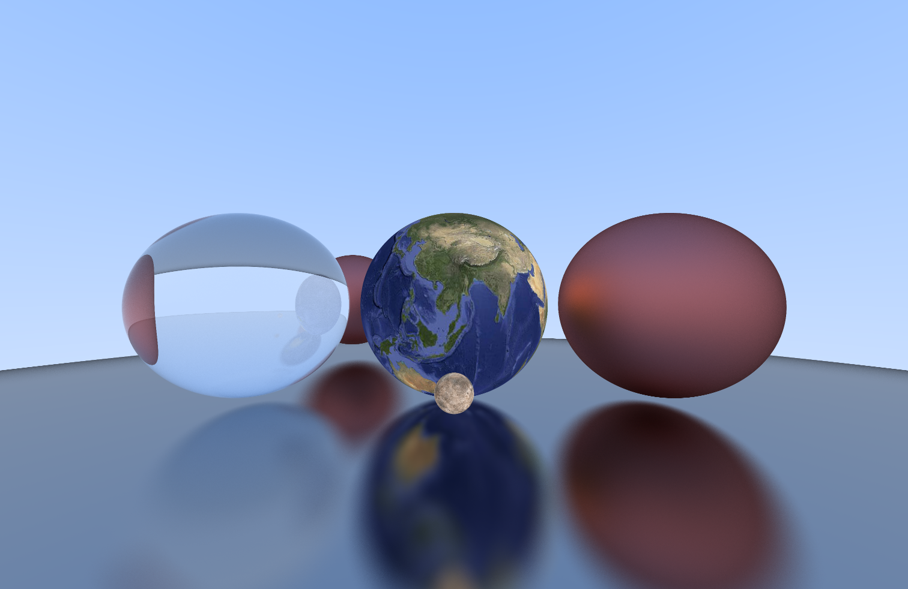

# Raytracing

A simple real-time ray tracer with a controllable camera.



## Getting Started

### Dependencies
* [SDL2](https://www.libsdl.org/) - window creation
* [glm](https://github.com/g-truc/glm) - math library

### Installing
```
>>> make build
```

### Executing program
```
>>> ./raytracer
```

## Acknowledgments
* [_Ray Tracing in One Weekend_](https://raytracing.github.io/books/RayTracingInOneWeekend.html)
* [_Ray Tracing: The Next Week_](https://raytracing.github.io/books/RayTracingTheNextWeek.html)